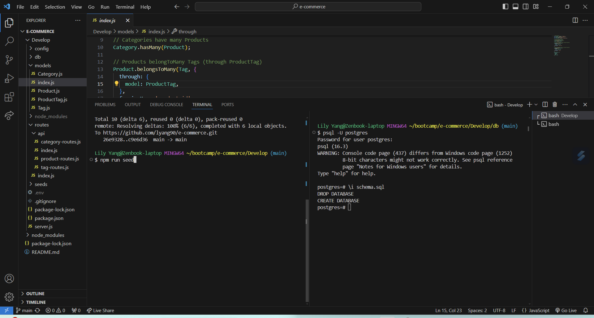
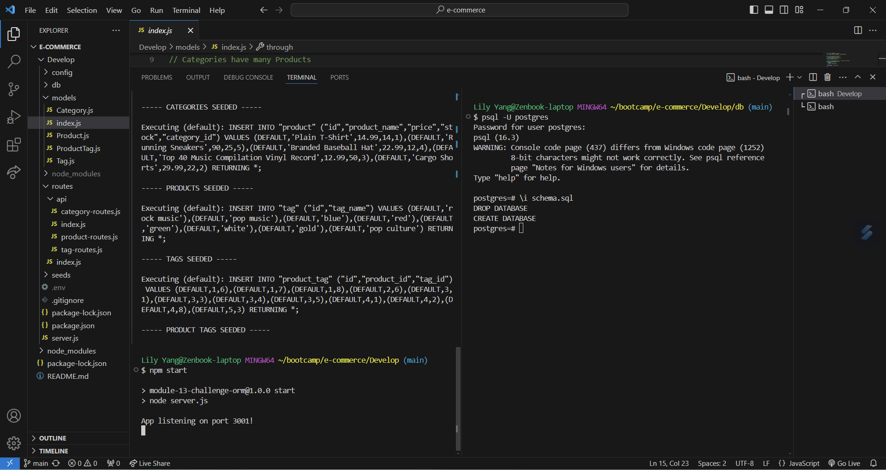
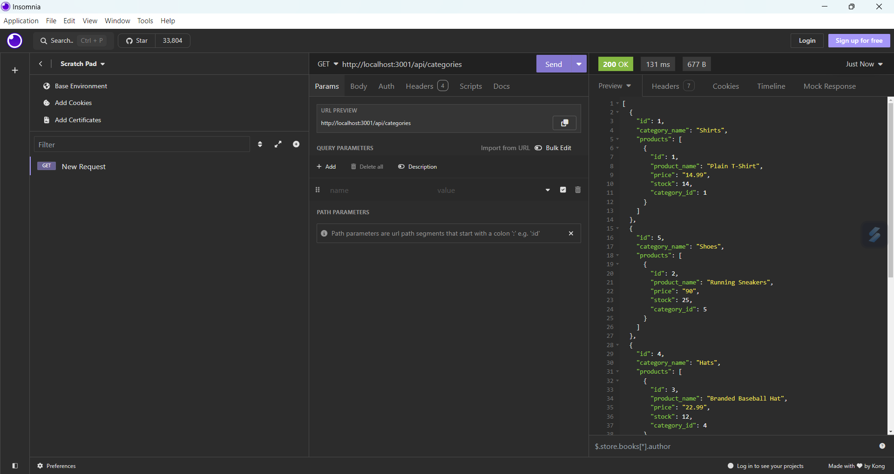
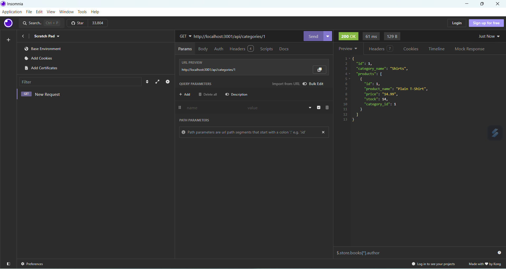
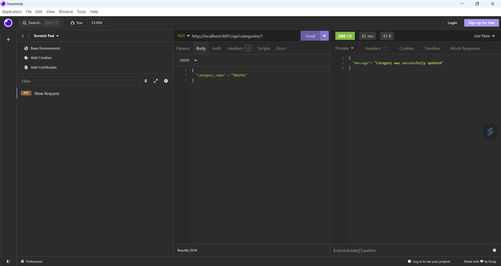
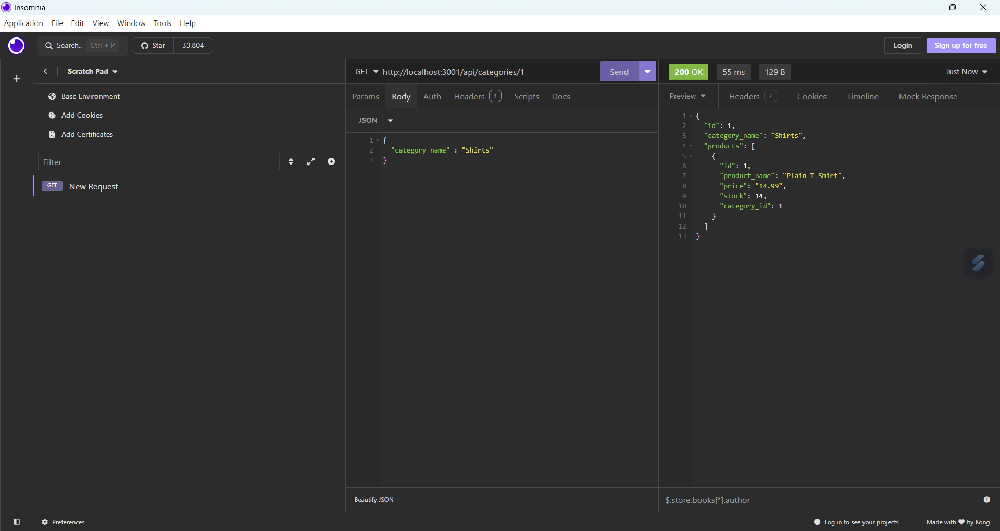

# E-Commerce

## Description
This project was created to keep track of products, the tags and the categories it was associated with. The main idea behind this project was to get learn how to use the Object relational mapping (ORM} to organize this files and connect it with SQL. Through creating this project I was able to learn more about how to use ORM and use them to create and connect with the databases. The project came with starter code and the parts which I worked on were the routes and models files.

## Usage
This project can be used as part of the back-end of a site to keep track of items being sold. To actually use you must run the create the database first by connecting with it and then creating it inside your terminal. Afterwards, you run the commands npm run seed to insert the data into the database which has been created. Then you can run npm start which will run the program and you can use Insomnia or another back-end app to insert or test the program. Here is the video link to the demo of the running the code. https://drive.google.com/file/d/1ko3XwgCpZ2HKeyByTRczkK5xNxHyUj5i/view

Connecting to the databse and inserting data into the database
 

Starting the program
 

Getting all the categories in Insomnia
 

Getting one category in Insomnia
 

Updating the category in Insomnia

Displaying the updated category in Insomnia

## Credits
- Starter Code from Xander Rapstine https://github.com/coding-boot-camp/bookish-sniffle
- Associations from Sequelize https://www.npmjs.com/package/uuid](https://sequelize.org/docs/v6/core-concepts/assocs/
- Eager Loading from Sequelize https://sequelize.org/docs/v6/advanced-association-concepts/eager-loading/#fetching-with-right-outer-join-mysql-mariadb-postgresql-and-mssql-only
- Vaildations from Sequelize https://sequelize.org/docs/v6/core-concepts/validations-and-constraints/
- UPDATE in Models from Sequwlize https://sequelize.org/docs/v7/querying/update/
